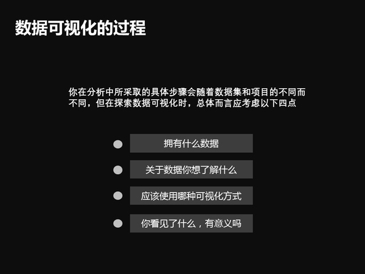
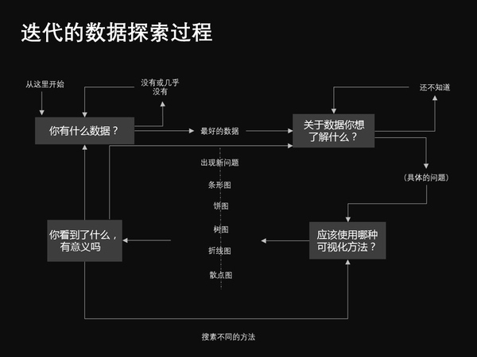
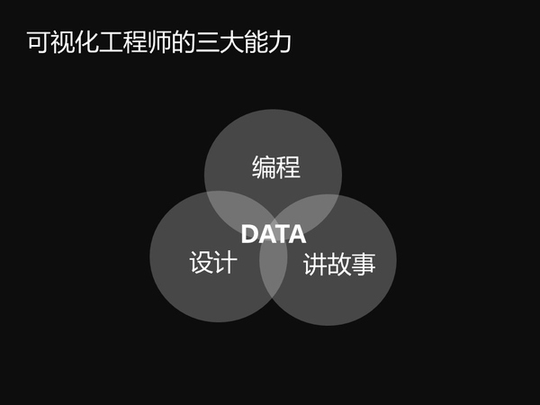
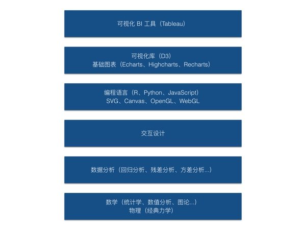
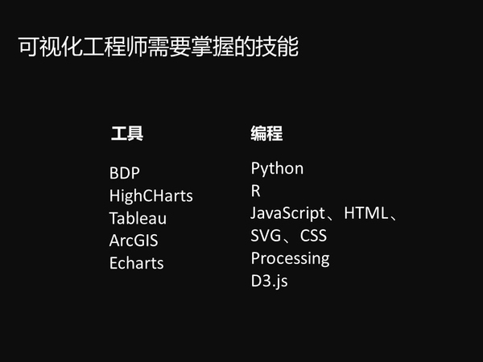
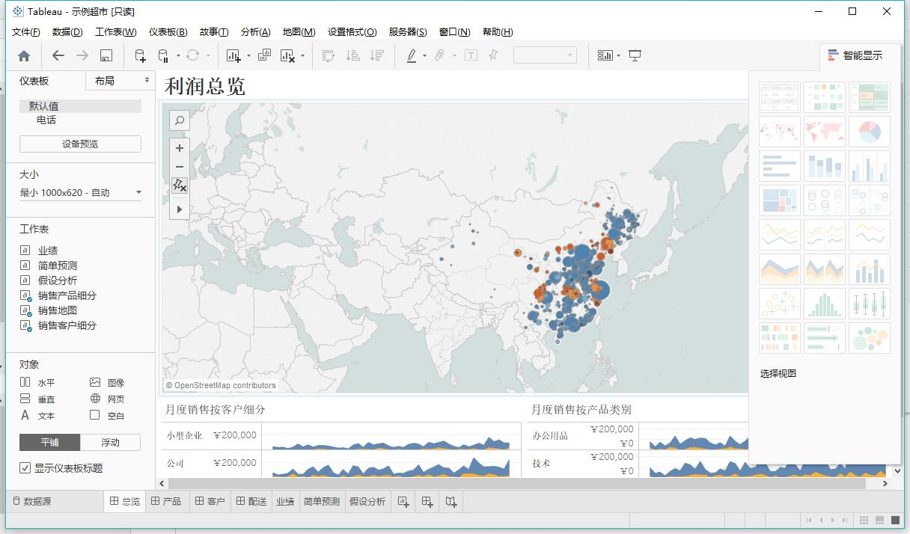
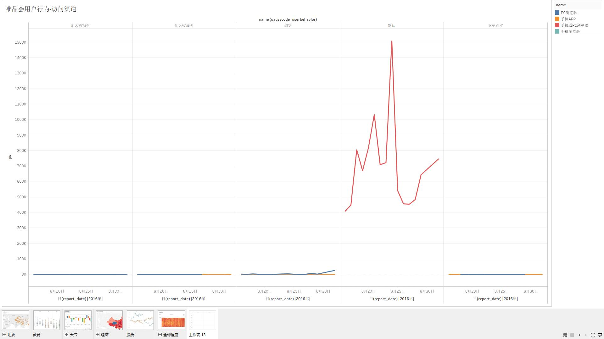
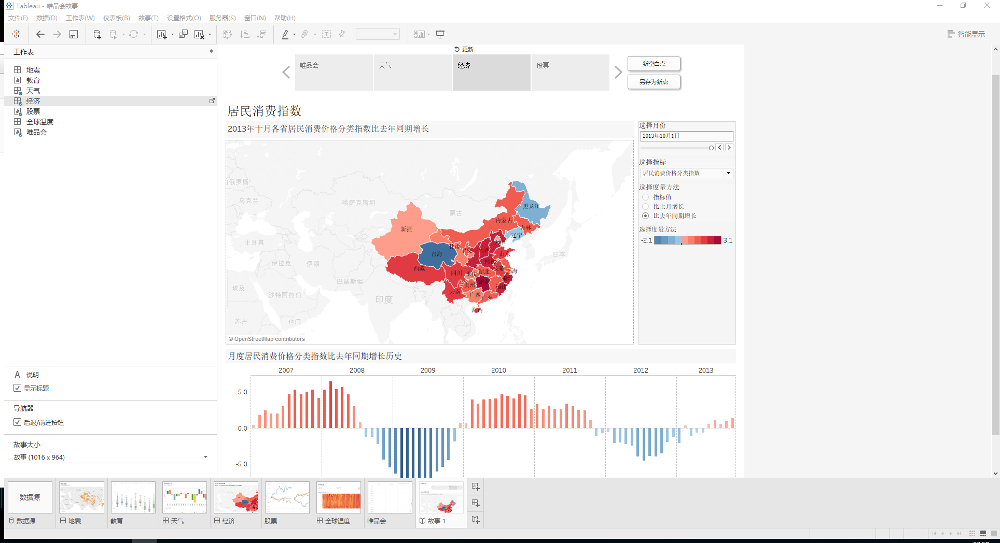

##  数据可视化-Tableau

###  什么是数据可视化？先来看几个问题吧~

#####  数据可视化的过程

#####  迭代的数据探索过程

#####  可视化工程师需具备的能力

#####  可视化工程师需掌握的技能

 那什么是数据可视化呢？来一个还算官方的解释：数据可视化，就是指将结构或非结构数据转换成适当的可视化图表，然后将隐藏在数据中的信息直接展现于人们面前

###  了解了什么是数据可视化，接下来看看数据可视化的工具吧！先来对比下几款常见好用的可视化工具,各有各的好处，还是要结合自身的需求.个人用，免费才是王道;公司用，最好是分析者可以简单上手，让IT更专注开发

 国内：
   帆软BI：【http://www.finebi.com/resources/downloads/】
       优点：
         有较为详细的行业案例与技术方案；
         产品演示和资源中心也较为清晰；
       缺点：
         需要使用客户端，增加了使用的不便利性；
         只有仪表盘展示，BI报表需要另一款产品；
         无法处理大量的数据；
   大数据魔镜：【http://www.moojnn.com/product-center/cloudAnalysis.html】
       优点：
         产品模块的规划比较健全，其中包括数据源导入、数据分析、仪表盘、数据挖掘和数据工厂；
         官网的设计不错，模板选择性大，颜值控可能会喜欢；
         工具使用指导清晰，使用篇和方法篇等比较详细；
       缺点：
         产品存在较多的BUG，UI和功能相对其他产品来说较简陋；
         部分产品模块并不能切实用于数据分析；
 国外：
   Tableau：
       优点：
         处于行业领导者地位，功能完善；
         有较好的图形展现与客户感知；
         新产品开始支持云端展现，但是需要客户端支持；
       缺点：
         相比于商业智能BI，更像一个基于数据查询的数据展示工具；
         处理不规范数据、转化复杂模型比较难；
         无法处理大量数据；
         国内网络连接Online版速度较慢；
   QlikView：【http://www.qlik.com/us/】
       优点：
         支持多端显示
         数据源无缝接入
         可视化仪表盘
         拖拉拽即可实现操作
         可以实现数据关联
         DeskTop完全免费，官方有免费的培训。
         内存式数据分析，分析速度非常快
       缺点：
         企业版需要费用
         对元数据中文支持不友好

###  亲身体验了下几款软件，Tableau和Qlik还是比较强大的，Tableau易用，但相较于专门的分析工具（比如R）还没有到达到很精细的程度，Qlik用起来比较费神，对中文支持也不是太好。最后决定使用Tableau，作为报表、数据分析工具中的网红，接下来就看一下Tableau使用的相关问题：

   1.Tableau Desktop, 基于斯坦福大学在数据分析领域中的突破性研究成果，利用令人耳目一新的拖曳方式来可视化数据，不需要编程知识
   2.看一下官方免费的培训视频还是很有必要的：【http://www.tableau.com/zh-cn/learn/training#connecting】
   3.微信的Tableau的社区公众号里有很多好玩的viz，还有些大神级的参赛作品，平台还会提供网络分享会的相关信息
   4.根据自己的分析思维(建立分析思维需要自己多练习，多多分析)，慢慢的由浅至深(基础分析，综合分析，逻辑组合表达)
   5.得出结论，并用语言阐述出来……
  
###  Tableau有学生版，跟专业版功能差不多，上传证明材料就可以免费使用，下载地址：【http://www.tableau.com/zh-cn/academic/students】
 其他不多说，开始使用Tableau Desktop吧！

##   数据可视化运用 -- 一个数据分析小白的吃油之路~
####或者说，是一只小白摸索入门数据分析之路~

###  磕磕碰碰，用Tableau链接了PostgreSQL数据库，拖拽了三个表join了下,简单的一个小分析算是出来了，没有过多修饰别名，凑合还能看，上图：

###  讲故事讲故事，只是想贴张图看看

 摸摸索索，突然意识到，分析是一种意识能力，猛然间感觉到了差距……那就先安利一些数据分析的知识：

 本质-->现象-->特征-->量化

 为什么分析？

 1.用户是谁（目标用户）
 2.从哪里来（流量从哪里来，流量的价值等）
 3.到哪里去（为什么离开，如何降低用户流失）

 分析要解决什么问题？

 对于产品：
 产品改版是否合理？
 用户的反馈如何？
 哪些功能存在问题？
 功能使用频率？
 转化路径是否靠谱？
 对于运营：
 用户来源路径？
 用户活跃度如何？
 如何分配广告预算？
 网站内容是否有效？
 如何分解KPI？

 分析-->改进-->维持
